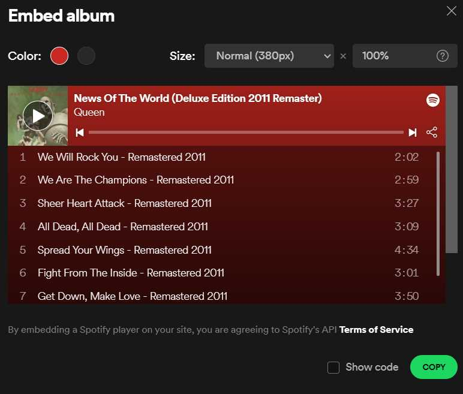

# Everything Html Embed (and other things)
 ### The spotify.html file
For this you need a spotify account....

Its easy, Got to [Spotify.com/login](https://spotify.com/login) then create an account with Google (Or any other email service).  
  
* Once your account is created -  click here ([Spotify](https://open.spotify.com/))

* To do more.... [Spotify Developer](https://developer.spotify.com/)

1. Then right click on any show, playlist, song etc.
2. Hover over Share
3. Click embed (song, playlist, show etc.)
4. Customize and copy the code...
5. Paste in a html website.



## Example code

This song in Happy by Pharrel Williams
 


```
<iframe src="https://open.spotify.com/embed/track/60nZcImufyMA1MKQY3dcCH" width="100%" height="80" frameBorder="0" allowtransparency="true" allow="encrypted-media"></iframe>
```
